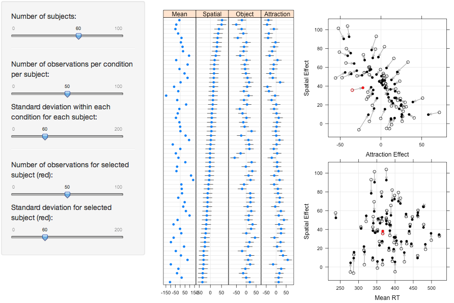
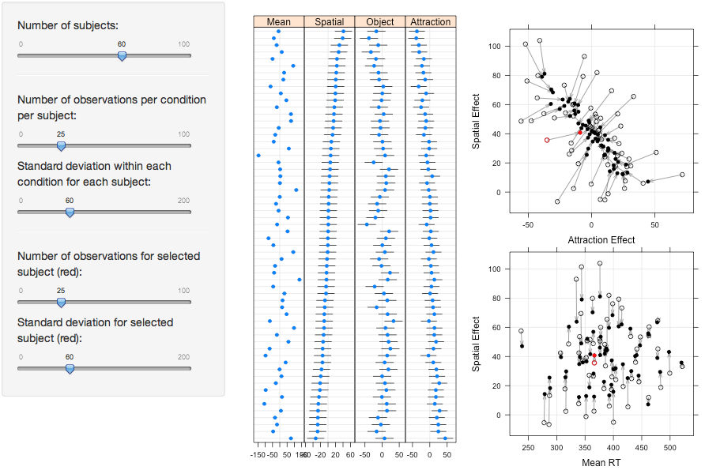
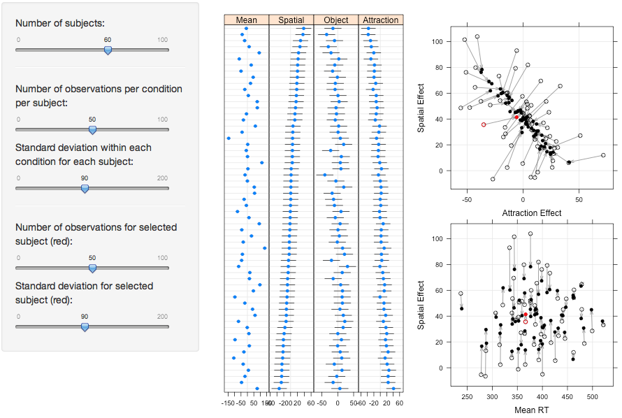
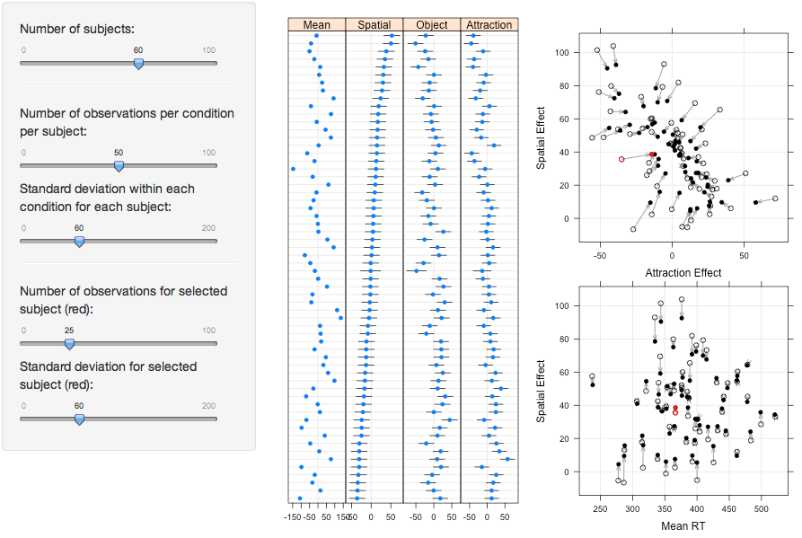
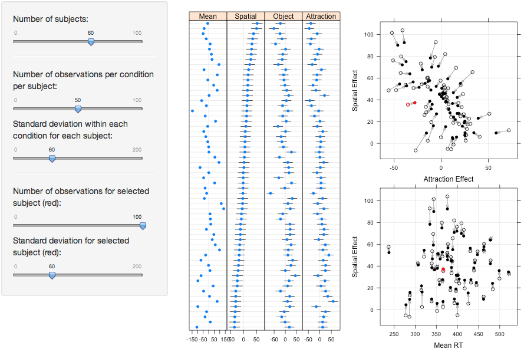
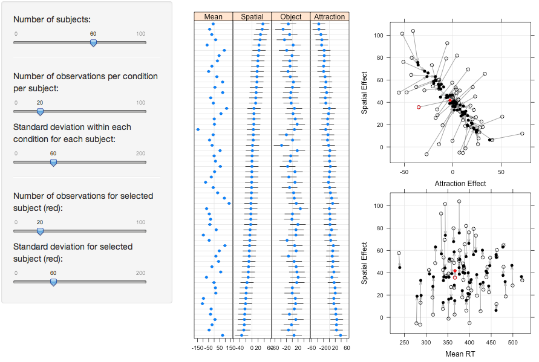
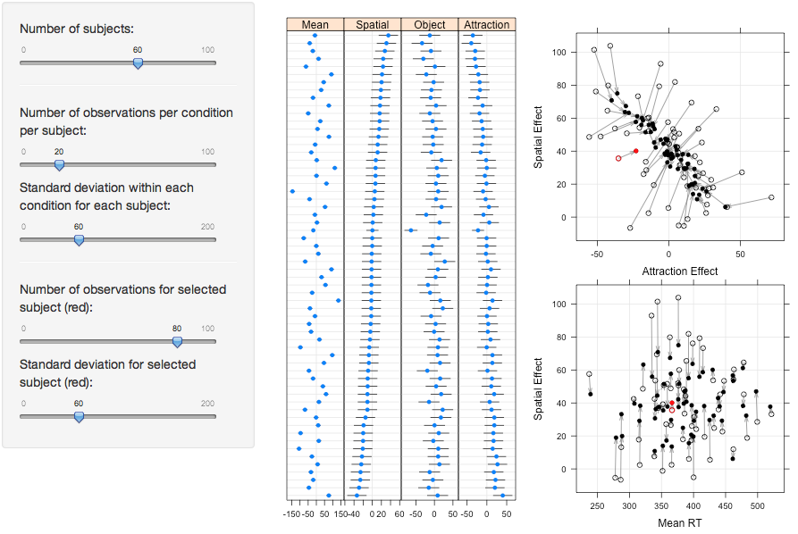

<p align="justify">
This interactive R Markdown document contains an application and tutorial, which can be used for illustrating shrinkage of observed data toward the estimated population mean in linear mixed models. LMM analyses are based on simulated data using mixedDesign() function (Hohenstein & Kliegl, 2013). Means, standard deviations and correlations used in mixedDesign() are calculated from experimental data by Kliegl, Wei, Dambacher, Yan and Zhou (2011) using the two-rectangle cueing paradigm (Egly, Driver & Rafal, 1994). These values are listed in the tutorial section. </p> 
                  

```{r, echo=FALSE, message=FALSE}
source("shrinkage_function.R")
shrinkage_app()
```

<h3> Tutorial </h3>
<p align="justify">
This application simulates a classical experiment of visual attention: the two-rectangle cueing paradigm (Egly et al., 1994). Attentional selection of visual information has been conceptualized as space-based (Posner, 1980), as object-based (Egly et al., 1994), and as being due to an attraction back to the original fixation location (Zhou, Chu, Li, & Zhan, 2006). These effects are replicated with simulated RT differences between four experimental conditions of the two-rectangle cueing paradigm and analyzed with a linear mixed model (LMM) using the lme4 package (Bates et al., 2014). For more information on the underlying experimental design, we refer to Kliegl et al. (2011).

<p align="justify">
The data will be simulated using mixedDesign() and rnorm() functions. The mixedDesign() function is specified with a within-subject factor with four levels, corresponding to the four experimental conditions: valid (val), same object - different location (sod), different object - same location (dos), and different object - diagonal location (dod). It generates mean values for each experimental condition of each subject, based on the correlations, means and standard deviations calculated from the experimental data by Kliegl et al. (2011). The input values for mixedDesign() are listed in Table 1 and 2. The rnorm() function is using the simulated mean values from mixedDesign() to generate normally distributed observations for each experimental condition for each subject.
</p>

Table 1: Correlations between levels of within-subject factor
```{r, echo=FALSE}
## table of correlations between levels of within subject factor
corr <- matrix(c(1, .91, .88, .84, 
                .91, 1, .95, .96, 
                .88, .95, 1, .96,
                .84, .96, .96, 1), nrow=4, ncol=4, byrow=TRUE)

colnames(corr) <- c("val", "sod", "dos", "dod")
rownames(corr) <- c("val", "sod", "dos", "dod")

as.table(corr, col.names=T, row.names=T)
```

Table 2: Means and standard deviations for each level of within-subject factor across all subjects
```{r, echo=FALSE}
## table of correlations between levels of within subject factor
means <- matrix(c(358,392,406,403), ncol=4)
standevAcrossSubjects <- matrix(c(48,61,59,62), ncol=4)
means_stand <- matrix(c(means,standevAcrossSubjects),ncol=2,nrow=4)

colnames(means_stand) <- c("M","SD")
rownames(means_stand) <- c("val", "sod", "dos", "dod")

as.table(means_stand,col.names=T,row.names=T)
```

</br>
<p align="justify">
The input for these functions can be specified using the different sliders in the shiny shrinkage application. The following section will outline the functionality of each slider:</p>
<p align="justify">
**Number of subjects:** The purpose of this slider is to define the number of subjects for the experiment. The mixedDesign() function generates four mean values per subject.
<p align="justify">
**Number of observations per condition per subject:** This slider defines the number of observations generated for each level of the experimental condition manipulated within each subject.</p>
<p align="justify">
**Standard deviation of observations within each condition for each subject:** For every subject, normally distributed values are generated for each experimental condition based on the mean from mixedDesign() and a standard deviation specified by this slider.</p>

<p align="justify">
This app can also be used to demonstrate shrinkage for a single subject's data (always the first subject in the data set), for example, the consequences for an outlier. For this purpose, the two sliders **Number of observations for selected subject (red)** and **Standard deviation for selected subject (red)** allow specification of the standard deviation within each condition and number of observations for the selected subject, independent of the two corresponding slider inputs for the other subjects.</p>
</br>
<h4> Examples </h4>
<p align="justify">
Shrinkage of a subject's mean depends on three factors: (a) The more extreme an observed mean, (b) the smaller the number of observations, and (c) the larger the within-subject variance, the more will this subject’s conditional mean be based on the overall mean (i.e., “shrunken” towards the population mean; see Gelman & Hill, 2007, especially chapters 12 and 18, for expositions). In this section, we provide examples how the shiny shrinkage app can be used to show the influence of these three factors on shrinkage. You can replicate each example using the application in the **Shrinkage Application** section of this document.
</p>
<p align="justify">
First, we specify an experiment that matches the design of Kliegl et al. (2011) to have standard deviations and number of data per experimental condition in line with expectations for such a reaction time experiment. (There is one departure from the original design in that we assume the same number of observations for each subject in each of the four conditions; in the original experiment the first condition was tested more frequently than the other three.) This configuration will serve as a **reference** for the following examples. The results are shown in Figure 1.
</p>
Figure 1:
</br>
 
</br>


<h5> Number of observations </h5>
<p align="justify">
In the first two examples (Figure 2 & 3), we manipulate the number of observations for each experimental condition for all subjects simultaneously. For these examples, the two sliders for **selected subject (red)** need to be set to the same values as the corresponding sliders for all subjects). The following figure demonstrates the increase in shrinkage if only half the number of observations compared to the reference configuration above are used (Figure 1):
</p>
Figure 2:
</br>
 
</br>
<p align="justify">
In contrast, doubling the amount of data in each within subject condition reduces the effect of shrinkage, as shown in the following figure:
</p>
Figure 3:
</br>
 
</br>

<h5> Standard deviation within each subject and within each condition</h5>
<p align="justify">
In the following examples (Figure 4 & 5), we varied the standard deviation within each subject for all subjects simultaneously. (Note that for these examples, the two sliders for **selected subject (red)**  need to be set to the same values as the corresponding sliders for all subjects). The following figure shows the increase in shrinkage when the standard deviation within each subject is increased relative to the reference configuration (Figure 1). Even more importantly, we note that the correlation for spatial and attraction effect increases substantiallyfor this setting, that is the black dots cluster along a negative regression slope. Such a larger correlation parameter may indicate that the complexity of the model is out of sync with what is supported by the data. Indeed, if the standard deviation within each subject is increased to 200, the conditional modes for both correlation parameters fall on straight lines, indicating perfect correlations. In this case, the model is definitely overparameterized; in other words the data no longer support estimation of such a complex model. 
</p>
Figure 4:
</br>
 
</br>
<p align="justify">
Reducing the standard deviation within each subject, on the other hand, reduces the effect of shrinkage, as shown in the following figure:
</p>
Figure 5:
</br>
 
</br>

<h5> Adjusting data of one subject </h5>
<p align="justify">
Here we illustrate the effect of shrinkage when the data for a single subject are changed. In the following examples (Figures 6-9) the two sliders for **selected subject (red)** are set to different values than the corresponding sliders for all subjects. Using a realistic configuration for the data of all subjects, as in the reference example, varying the standard deviation for the selected subject does not have a strong influence on the shrinkage of this subject's data. Varying the number of observations for a single subject consistently shows a strong effect on shrinkage of this subject's data. 
</p>
<p align="justify">
Figure 6 shows the increase in shrinkage for the selected subject (red) compared to the reference configuration above (Figure 1) when the number of observations for this subject is reduced to half the the number of data for other subjects:
</p>
Figure 6:
</br>
 
</br>
<p align="justify">
Conversely, doubling the number of data for this subject results in a decrease in shrinkage for the selected subject (red):
</p>
Figure 7:
</br>
 
</br>
<p align="justify">
Both a decrease and increase in number of observations for the selected subject strongly influenced the shrinkage of this subject's data, while the data of the remaining subjects remained largely unaffected. What happens if we change the number of data  (i.e., both the number of subjects and the number of observations per subject) of the entire sample relative to those of the selected subject? If the number of observations for all subjects is reduced, increasing the number of observations for the selected subject not only reduces shrinkage for this subject's means, but also for the means of all subjects. The smaller the number of observations for all subjects, the stronger will be the influence of one subject's data.
</p>
<p align="justify">
An illustration of this pattern is provided in Figures 8 and 9. For both configurations, first we reduced the number of observations for all subjects to half of those in the reference configuration (Figure 1). Figures 8 (identical with Figure 2) and 9  differ only in the number of observations for the selected subject. 
</p>
Figure 8:
</br>
 
</br>
<p align="justify">
As already mentioned above, when the number of observations for all subjects is small, doubling the number of observations for one subject decreases the effect of shrinkage both on the selected subject's means (Figure 9).
</p>
Figure 9:
</br>
 
</br>

</br>

**References**
</br>
Bates, D., Mächler, M., Bolker, B. J., & Walker, S. C. (2014). Fitting linear mixed-effects models using lme4. *Journal of Statistical Software*.
</br>
Egly, R., Driver, J. & Rafal, R. D. (1994). Shifting visual attention between objects and locations: evidence from normal and parietal lesion subjects. *Journal of Experimental Psychology: General, 123*, 161-177. 
</br>
Gelman, A., & Hill, J. (2007). *Data analysis using regression and multilevel/hierarchical models*. Cambridge, MA: Cambridge
University Press.
</br>
Hohenstein, S. & Kliegl, R. (2013). Simulation of Factorial Mixed-Model Designs in R: The mixedDesign() Function.
</br>
Kliegl, R., Masson, M. E. J, & Richter, E. M. (2010). A linear mixed model analysis of masked repetition priming. *Visual Cognition, 18(5)*, 655-681. 
</br>
Kliegl, R., Wei, P., Dambacher, M., Yan, M. & Zhou, X. (2011). Experimental effects and individual differences in linear mixed models: estimating the relationship between spatial, object and attraction effects in visual attention. *Frontiers in Psychology, 2*, 1-12.
</br>
Posner, M.I. (1980). Orienting of attention. *Quarterly Journal of Experimental Psychology, 32*, 3-25.
</br>
Zhou, X., Chu, H., Li, X., & Zhan, Y. (2006). Center of mass attracts attention. *Neuroreport, 17*, 85-88.
</br>
</br>
**Corresponding author**</br>
<p align="justify">
Address: University of Potsdam, Department of Psychology, Building 14, Room 4.04, Karl-Liebknecht-Str. 24-25, 14476 Potsdam, Germany. </br>
E-mail address: kliegl@uni-potsdam.de (Reinhold Kliegl).</br>
Potsdam Mind Research Repository: http://read.psych.uni-potsdam.de/pmr2/
 </p>