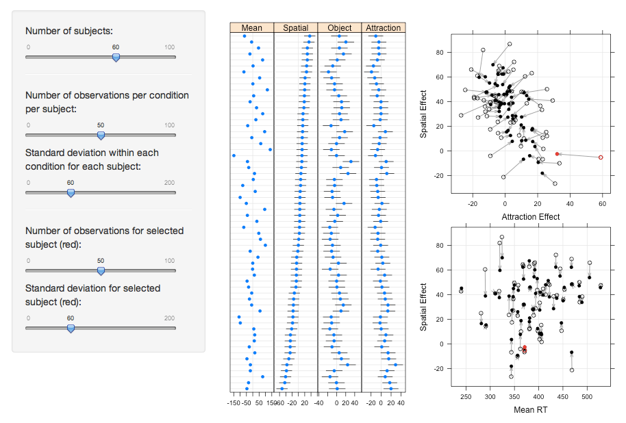
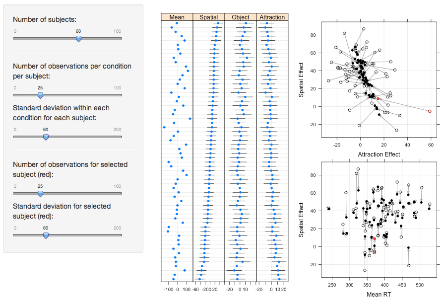
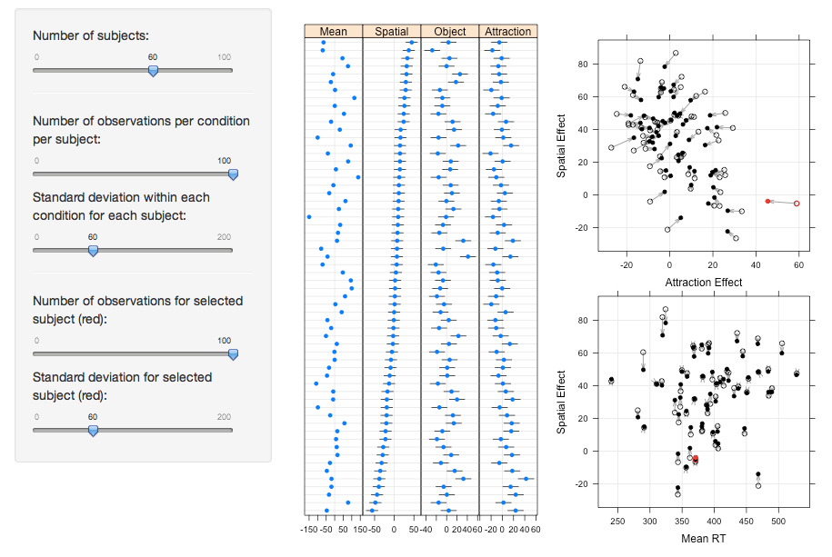
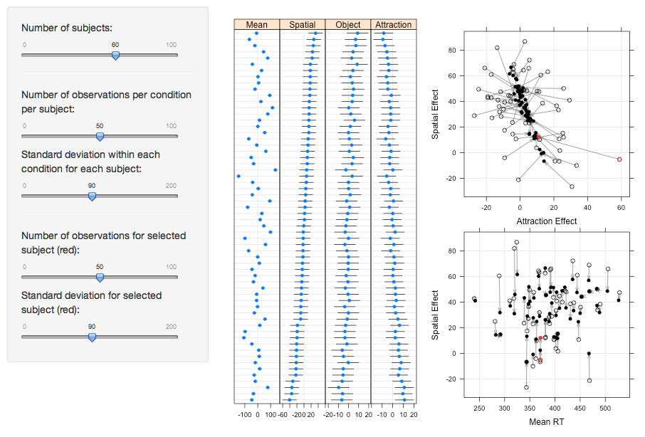
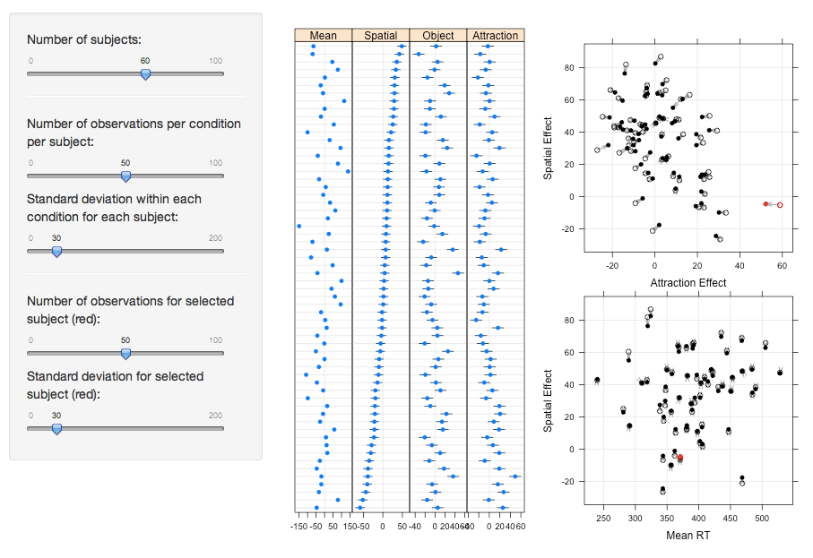
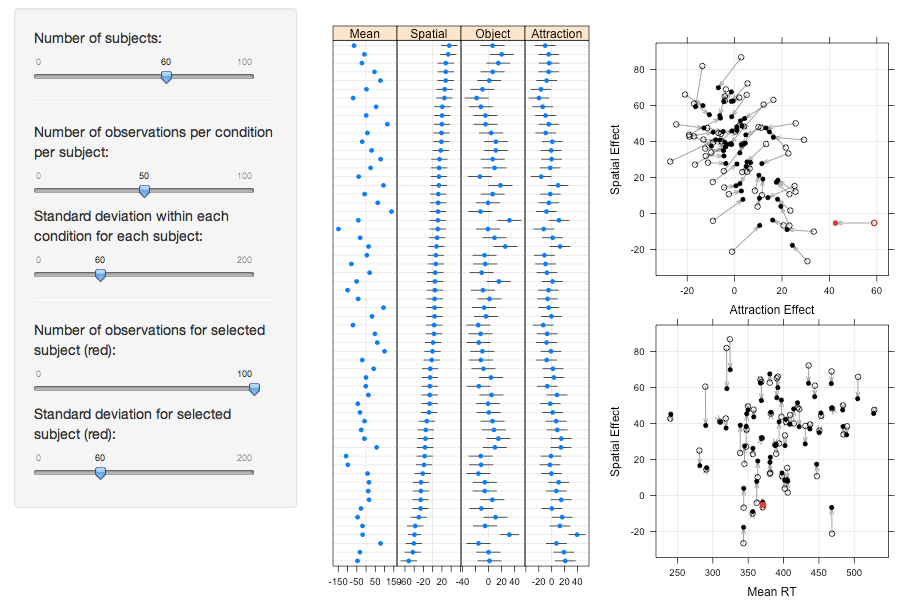
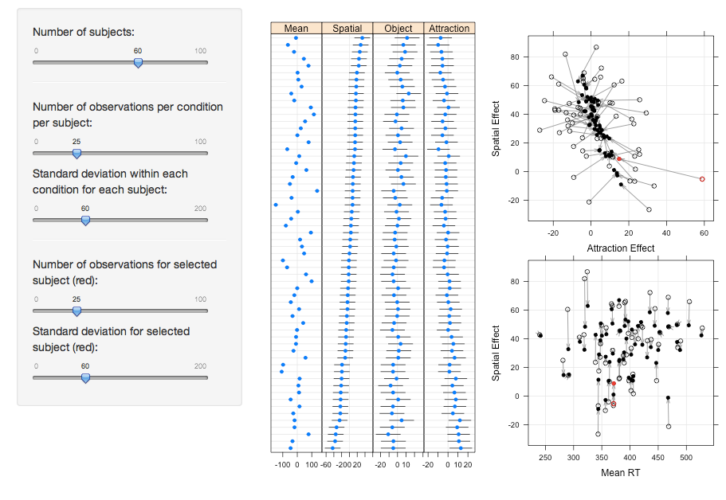

</br>
This R Markdown document is made **interactive** using Shiny. The code for the application can be found in the R scripts **server.R** and **ui.R**.

```{r, echo=FALSE}
shinyAppDir("../shiny_shrinkage_simulated",
            options=list(
              width="100%", height = "800px"
                         )
            )
```

<h3> Tutorial </h3>
<p align="justify">
This application simulates a classical experiment of visual attention: the two-rectangle cueing paradigm (Egly et al., 1994). Attentional selection of visual information has been conceptualized as space-based, as object-based, and as being due to an attraction back to the original fixation location. These effects are replicated with simulated RT differences between four experimental conditions of the two-rectangle cueing paradigm. For more information on the underlying experimental design, refer to Kliegl et al. (2011).</p>
<p align="justify">
The data will be simulated using mixedDesign() and rnorm() functions. The input for these functions can be specified using the different sliders in the shiny shrinkage application. The following section will outline the functionality of each slider:</p>
<p align="justify">
**Number of subjects:** The purpose of this slider is to define the number of subjects for the experiment. The mixedDesign() function generates four mean values per subject.
<p align="justify">
**Standard deviation within subjects:** For every subject, normally distributed values are generated for each experimental condition based on the mean from mixedDesign() and a standard deviation specified by this slider.</p>
<p align="justify">
**Amount of observations per within subject factor:** This slider defines the number of values, which are generated for each experimental condition of every subject.</p>
<p align="justify">
This app can also be used to show the effect that one subject's data (always first subject in data set) has on shrinkage. For this purpose, the two sliders **Standard deviation for selected subject (red):** and **Amount of observations for selected subject (red):** simulate the standard deviation and amount of observations for the selected subject independently of the two corresponding slider inputs for the other subjects.</p>
</br>
<h4> Examples </h4>
<p align="justify">
Kliegl, Masson and Richter (2010) indicated that shrinkage is essentially influenced by three factors. That is, a) the more extreme an observed mean, b) the smaller the number of observations, and c) the larger the variance for a given subject’s data, the more will this subject’s conditional mean be based on the overall mean (i.e., “shrunken” towards the population mean; see Gelman & Hill, 2007, especially chapters 12 and 18, for expositions). In this section, we provide examples how the shiny shrinkage app can be used to show the influence of the above mentioned factors on shrinkage. You can replicate each example using the application in the **Shrinkage Application** section of this document.
</p>
<p align="justify">
First, we configured the input to match the experimental data from Kliegl et al (2011), to assure that standard deviations and amount of data per within-subject factor are in line with expectations for reaction time experiments.
The results for this configuration are shown in the first figure, which will be used as a **reference** for all subsequent examples:
</p>
Figure 1:
</br>
 
</br>


<h5> Number of observations </h5>
<p align="justify">
In the first examples (Figure 2 & 3), we manipulated the amount of observations in each within subject factor for all subjects simulataneously, to illustrate its influence on shrinkage (note that for these examples, the two sliders for **selected subject (red)** need to be set to the same values as the corresponding sliders for all subjects). The following figure shows the increase in shrinkage as the amount of data is reduced to half of the slider input compared to the reference configuration above (Figure 1):
</p>
Figure 2:
</br>
 
</br>
<p align="justify">
In contrast, doubling the amount of data in each within subject condition reduces the effect of shrinkage, as shown in the following figure:
</p>
Figure 3:
</br>
 
</br>

<h5> Standard deviation within subjects </h5>
<p align="justify">
In the follwing examples (Figure 4 & 5), we varied the standard deviation within each subject for all subjects simulataneously, to illustrate its influence on shrinkage (note that for these examples, the two sliders for **selected subject (red)** again need to be set to the same values as the corresponding sliders for all subjects). The following figure shows the increase in shrinkage as the standard deviation within each subject increased compared to the reference configuration above (Figure 1):
</p>
Figure 4:
</br>
 
</br>
<p align="justify">
Reducing the standard deviation within each subject, on the other hand, reduces the effect of shrinkage, as shown in the following figure:
</p>
Figure 5:
</br>
 
</br>

<h5> Adjusting data of one subject </h5>
<p align="justify">
Finally, we also want to illustrate the effect of shrinkage by varying the data for a single subject (note that for the follwing examples (Figure 6-9) the two sliders for **selected subject (red)** are set to different values than the corresponding sliders for all subjects). We observed, that varying the standard deviation for the selected subject does not have a strong influence on the shrinkage of this subject's data. However, as the amount of data (i.e. the number of subjects, as well as the amount of observations per subject) of the remaining subjects decreases, the influence of one subject's standard deviation gets stronger. Varying the amount of observations for one subject, on the other hand, consitently shows a strong effect on shrinkage of the subject's data. Therefore, for the following examples we focused on manipulating the number of observations for the selected subject.
</p>
<p align="justify">
Figure 6 shows the increase in shrinkage for the selected subject (red) compared to the reference configuration above (Figure 1), as the amount of data for this subject is reduced to half of the amount of data for all subjects:
</p>
Figure 6:
</br>
 
</br>
<p align="justify">
Doubling the amount of data for this subject compared to all remaining subjects results in a decrease in shrinkage for the selected subject (red):
</p>
Figure 7:
</br>
 
</br>
<p align="justify">
Note that both adjustments for the selected subject strongly influenced the shrinkage of this subject's data, while the data of the remaining subjects remained largely unaffected. However, if the amount of data for all subjects is reduced, increasing the amount of data for the selected subject not only reduces shrinkage for this subject's data, but also for the data of all subjects. We observed, that the lower the number of observations for all subjects, the stronger the influence of one subject's data will be. An example of this effect is shown in Figures 8 and 9. For both configurations, we reduced the amount of data for all subjects to half of the reference configuration (Figure 1). Figures 8 and 9 only differ in the amount of data for the selected subject. 
</p>
Figure 8:
</br>
 
</br>
<p align="justify">
As mentioned above, given that the amount of observations for all subjects is rather low, Figure 9 shows that doubling the amount of data for one subject decreases the effect of shrinkage both on the selected subject's data and the data of the remaining subjects.
</p>
Figure 9:
</br>
 
</br>

</br>

**References:**
</br>
Egly, R., Driver, J. & Rafal, R. D. (1994). Shifting visual attention between objects and locations: evidence from normal and parietal lesion subjects. *Journal of Experimental Psychology: General, 123*, 161-177. 
</br>
Gelman, A., & Hill, J. (2007). *Data analysis using regression and multilevel/hierarchical models*. Cambridge, MA: Cambridge
University Press.
</br>
Hohenstein, S. & Kliegl, R. (2013). Simulation of Factorial Mixed-Model Designs in R: The mixedDesign() Function.
</br>
Kliegl, R., Masson, M. E. J, & Richter, E. M. (2010). A linear mixed model analysis of masked repetition priming. *Visual Cognition, 18(5)*, 655-681. 
</br>
Kliegl, R., Wei, P., Dambacher, M., Yan, M. & Zhou, X. (2011). Experimental effects and individual differences in linear mixed models: estimating the relationship between spatial, object and attraction effects in visual attention. *Frontiers in Psychology, 2*, 1-12.
